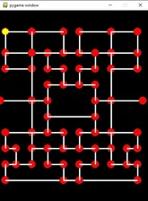

# Projet Pacman réalisé par Djamel Abdedou et Massil Ben khemou.
Ce site Web explique comment programmer un jeu Pacman en langage Python à l'aide de Pygame. Afin de tirer le meilleur parti de ce site, vous devez progresser dans chaque « niveau » de manière séquentielle. Le code de chaque niveau s'appuie sur les niveaux précédents. Au final, vous aurez un jeu Pacman complet.

SECTIONS : 

Commencer

nous créons une classe Vector, ouvrons une fenêtre de base et déplaçons un personnage sur l'écran.

Level_1 

Dans ce niveau, nous créons un écran vide et créons un objet Pacman de base qui peut se déplacer sur l'écran.

Level_2

Ici, nous parlons des nœuds et limitons les mouvements de Pacman afin qu'il ne puisse se déplacer qu'entre ces nœuds.

Level_3

Nous ajoutons les ennemis fantômes. Nous commençons avec un seul fantôme, puis nous développons à partir de là.

Level_4

Nous lions  le tout ensemble avant de lui donner un aspect.

Level_5

Nous ajoutons du texte, des sprites et des animations.

Level_final 

Nous ajoutons quelques touches finales comme plus de labyrinthes et la mort du pacman.

Menu 

Ici vous pouvz voir le menu d'acceuil lors de l'éxécution du code. On y insert son nom de joueur et ensuite il faut cliquer sur start pour lancer le jeu.
